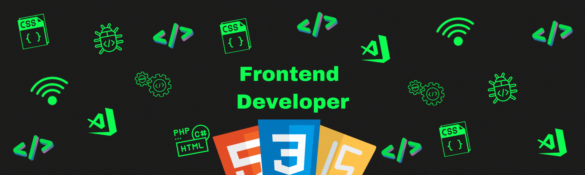

<h1 align="center">Hi 👋, I'm Damian Duda</h1>
<h3 align="center">A passionate frontend developer from Poland, second year student</h3>

  

- 🔭 I’m currently working on **Project: Global Forces**

- 🌱 I’m currently learning **React.js, Next.js, Node.js, Three.js**

- 👨‍💻 All of my projects are available at [https://thadon1110.github.io/portfolio/](https://thadon1110.github.io/portfolio/)

- 📫 How to reach me **damian.duda2302@gmail.com**

- ⚡ Fun fact **I'm also learning Game Development and 3D Graphic**
---
<h3 align="left">Connect with me:</h3>

<h3 align="left">Languages and Tools:</h3>
<h4 align="left">Actually using:</h4>

	
	
	 
	
	
	
	
	
	
	
	
	

<h4 align="left">Still Learning:</h4>

	
	
	
	
	

<h4 align="left">GameDev:</h4>

	
	
	
	
	

---

<h3 align="left">Statistics:</h3>

<!-- 
&nbsp;
 -->
